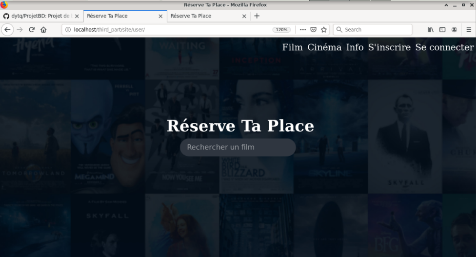

# Reserve Ta Place

Le projet est un site de réservation de place de cinéma utilisant une base de donnée pour stocker toutes les informations.

# Introduction 

## Description du projet

Le but de ce projet est de créer site de réservation de place de cinéma. Ce
site permettra à un utilisateur de :

- Consulter les films qui sont à l’affiche
- Obtenir des informations sur ces films, genre, descriptions, réalisateurs,
durée etc...
- Rechercher un film.
- Savoir quand aura lieu la projection d’un film et dans quel salle de cinéma.
- Se créer un compte, afin de pouvoir faire : une réservation d’une place de
cinéma et noter un film.
- Pour créer un compte, la base de données sauvegardera son nom, son
prénom, son e-mail (afin de signalé à l’utilisateur en cas de problème ou
bien de lui confirmer une réservation), son mot de passe et s’il a une
réduction.

## Modèle E/R

## Shéma Relationelle

### Clés primaire

- Client(num_client, nom, prenom, email, mot_de_pass, reduction)
- Film(num_film, nom, genre, duree, origine, version_disponible)
- Personne(num_personne, nom, prenom, age)
- Salle(num_salle, nb_place, nom_du_cinema)
- Cinema(num_cinema, compagnie,ville)
- Veut_voir(num_veut_voir, num_se_joue, num_client, num_film, prix)
- Note(num_client, num_film, note)
- Participe_au_film(num_personne, num_film, metier)
- Suit(num_film_prec, num_film_suiv)
- SeJoueDans(num_se_joue, jour, version, num_salle, num_film, nom_du_cinema)

### Clés étrangères

- Salle(nom_du_cinema) REFERENCES Cinema(nom)
- VeutVoir(num_se_joue) REFERENCES Se_joue_dans(num_se_joue)
- VeutVoir(num_client) REFERENCES Client(num_client)
- VeutVoir(num_film) REFERENCES Film(num_film)
- Note(num_client) REFERENCES Client(num_client)
- Note(num_film) REFERENCES Film(num_film)
- Participe_au_film(num_personne) REFERENCES Personne(num_personne)
- Participe_au_film(num_film) REFERENCES Film(num_film)
- Suit(num_film_prec) REFERENCES Film(num_film)
- Suit(num_film_suiv) REFERENCES Film(num_film)
- Se_joue_dans(num_salle, nom_du_cinema) REFERENCES Salle(num_salle,
nom_du_cinema)
- Se_joue_dans(num_film) REFERENCES Film(num_film)

### Détails Technique

- Un compte client peut réserver plusieurs places de cinéma pour la même
projection. On a ajouter num_se_joue dans Veut_voir pour le modéliser.
- Un compte client à le choix de réserver un film à une certaine date et une
certaine heure.
- Personne : ce sont ceux qui participe à la réalisation du film, les réalisa-
teurs, les acteurs etc...
- Film :
- Un film peut suivre 1 seul et unique film
Pour le film Die Hard, on aura comme film suivant Die Hard 2 et
aucun film précédent. Par contre Die Hard 2 a pour film suivant Die
Hardy 3 et comme film précédent Die Hard. Nous avons certes Die
Hard 3 qui suit Die Hard mais pas directement, d’où la cardinalité
1...1
- Un film peut-être en VO ou VF.
- L’attribue version_disponible dans film indique quel type de version est
disponible pour un film, "all" pour vf et vo, "vf" pour vf seulement et
"vo" pour vo seulement, la projection d’un film doit respecté les versions
disponible ; Par exemple pour le film Die hard les versions disponibles est
uniquement vo, donc dans la table Se_joue_dans on ne pourra pas avoir
une projection en vf.
- Une personne peut avoir un metier different selon les film, d’où l’attribue
metier dans la table Participe_au_film.

# Modélisation de la base de données

## Types de sessions
On a distingué trois types de sessions afin d’attribuer des droits d’utilisations
à la base de données.

### Utilisateur Anonyme

C’est un utilisateur qui ne se connecte pas. Il aura accès à toute la base de
données en lecture seulement.

### Clients
Le clients peut modifier les éléments liées à la table compte,à ses réservations
et à la note qu’il peut donner à un film. Le reste des tables est un lecture seule.

### Administrateur
C’est celui qui peut modifier l’entièreté de la base de données.

## Requête
On a réalisé différents types de requêtes afin de répondre aux besoins d’un
clients et de l’administrateur.

Requête d’un utilisateur anonyme:

- Recherche d’un film.
- Accès aux détails du film.

# MODÉLISATION DE LA BASE DE DONNÉES
- Classements des films les mieux notés.
- Consultation du nombre de clients inscrits

## Requête d’un client
- Afficher le nombre de places disponible pour un film donné.(sur la base
de donnée on a mis le nombre de place maximum).
- Descriptif du reçut pour l’achat d’une place de cinéma.

## Requête pour un administrateur
Affiche:

- toutes les tables
- le nombre de comptes clients crées.
- les bénéfices de chaque cinéma.
- le total des bénéfices

## Requête d’insertion
Ajout d’un compte lors de sa création.Le reste est géré par l’administrateur
(ajout d’un cinéma, d’un film etc...)

## Mise à jour des tables

Un client peut modifié sa table, modifier son mot de passe etc...

##Les vues

On a crées différentes vue :

- Une vue répertoriant tous les film en français et une autre tous les films
en version original.
- une vue présentant tous les personnes bénéficiant d’une réduction.
- une vue ou on a que les personnes majeurs.Chapitre 3

# Création du site internet

Le site est séparé en deux parties distincte décrit ci dessous :

- Utilisateurs
- Administrateur

## Utilisateurs

Quand on se connecte on ouvre une session.Avec cette session le client peut
réserver un film, s’abonner au site pour profiter de réductions, de noter un film
sur 5 et de consulter son historique de réservations.

# CRÉATION DU SITE INTERNET

Nous avons facilité la navigation sur le site par la mise en places des différents
liens en haut de page et une barre de recherche pour avoir la fiche descriptive
d’un film.Avec ces liens nous pouvons voir les films proposés, les différents ciné-
mas, la possibilité de se connecter et de s’inscrire au site. Quand on se connecte
on ouvre une session.Avec cette session le client a peut réserver un film, s’abon-
ner au site pour profiter de réductions, de noter un film sur 5 et de consulter
son historique de réservations.

## Administrateur

Pour accéder à la partie administration nous avons besoin de se connec-
ter.Avec les informations récolté nous ouvrons une session si la connections est
permise pour accéder à la base de données.
Un administrateur a besoin de modifié, de rechercher, et d’avoir un résumé
des différentes opérations dans la base de données.Ainsi, nous avons facilité cette
tâche à travers une interface web.

## Modification

Dans cette partie l’administrateur peut modifier et faire des recherches d’in-
formations sur la base de donnée.Par exemple si l’administrateur souhaite ajou-
ter des films ou bien supprimer un utilisateurs indésirable.

## Statistique

C’est un résumé du bilan financier qu’à généré le site (profits des films,des
cinémas...).3.4. DÉTAIL TECHNIQUE :FEUILLE DE STYLE

## Détail technique :feuille de style

- Nous avons une feuille de style pour l’accueil et une autre pour le reste.
- Pas de feuille de style pour l’administrateur car ce n’était d’utile
